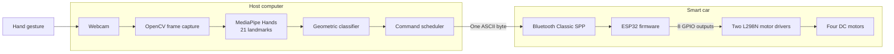

# Camera-Gesture Control of a Bluetooth Smart Car

This project implements a camera-based gesture interface for a four-wheel robotic car. A host computer captures webcam frames, uses MediaPipe Hands to estimate 21 hand landmarks, and classifies seven gestures with deterministic geometric rules. Each recognized action is transmitted as a single ASCII byte over Bluetooth Classic Serial Port Profile (SPP). An ESP32 receives the command and controls four DC motors through two L298N motor-driver modules.

The repository contains the ESP32 firmware, a gesture controller, a keyboard-based diagnostic controller, and automated tests for gesture recognition and command sequencing. The system is a teleoperated, open-loop prototype: the camera observes the operator's hand, not the vehicle's environment.

## Project Documentation

- [Technical report](doc/technical-report.pdf)
- [Project presentation](doc/Smart_Car_revised.pptx)
- [Demonstration video](doc/SmartCar.MP4)
- [Firmware guide](firmware/README.md)
- [Controller guide](tools/README.md)

## System Architecture



Vision processing and command scheduling run on the host computer. The ESP32 is responsible only for Bluetooth command decoding and deterministic motor-direction control. This division keeps the wireless protocol small and avoids running computer-vision workloads on the microcontroller.

## Implemented Features

- Seven motion states: forward, backward, arc left, arc right, spin left, spin right, and stop.
- Rule-based gesture classification using scale-tolerant landmark distance ratios and a directional dead zone.
- Camera-recorded custom static gestures mapped to ordered motion sequences.
- An English Qt desktop configurator for recording, arranging, and saving custom gestures.
- Bluetooth Classic SPP communication through a one-byte application protocol.
- Keyboard control for testing the Bluetooth, firmware, and mechanical subsystems without the camera.
- Duplicate-command suppression and controlled transitions between movement commands.
- Automatic stop after a configurable period without a valid gesture.
- Unit tests for gesture classification, command scheduling, and serial writes.

## Hardware

The assembled prototype uses the following components:

| Component | Purpose |
| --- | --- |
| ESP32 development board | Bluetooth communication and motor-control logic |
| Four DC gear motors and wheels | Vehicle propulsion and steering |
| Two L298N dual H-bridge modules | Four independent motor channels |
| Two-cell 18650 battery pack | Vehicle power supply |
| Four-wheel chassis, wiring, and connectors | Mechanical and electrical integration |
| Host computer with webcam | Image capture, gesture recognition, and command transmission |

The exact GPIO-to-motor assignment is defined in [`firmware/firmware.ino`](firmware/firmware.ino). Confirm the motor-driver wiring, shared ground, supply voltage, polarity, and enable-pin configuration before powering the vehicle.

## Software Requirements

- Python 3.12
- [uv](https://docs.astral.sh/uv/) for Python dependency management
- [Arduino CLI](https://arduino.github.io/arduino-cli/) with the ESP32 core
- A host computer with a webcam and Bluetooth Classic SPP support
- Optional: [mise](https://mise.jdx.dev/) and [direnv](https://direnv.net/) for the repository-managed development environment

The Python environment installs MediaPipe, OpenCV, PySide6, PySerial, JAX, and the remaining dependencies declared in [`pyproject.toml`](pyproject.toml). The repository's [`mise.toml`](mise.toml) selects Python 3.12, uv 0.11, and Arduino CLI 1.

## Setup

### 1. Prepare the Python environment

From the repository root, install the pinned tools and dependencies with mise and direnv:

```sh
mise trust
mise install
direnv allow
```

The provided `.envrc` creates the virtual environment and runs `uv sync --frozen`. If mise and direnv are not used, install Python 3.12 and uv, then run:

```sh
uv sync --frozen
```

### 2. Install ESP32 support

```sh
arduino-cli core install esp32:esp32
```

### 3. Compile and upload the firmware

Connect the ESP32 to the host over USB and replace `<device>` with its USB serial port:

```sh
arduino-cli compile firmware \
  --fqbn esp32:esp32:esp32 \
  --build-path ./build \
  --port <device> \
  --upload
```

After startup, the firmware initializes all motor outputs to `LOW` and advertises the Bluetooth device name `roboS`.

### 4. Pair the Bluetooth connection

Pair the host computer with `roboS` and identify the virtual serial port created by the operating system. The controllers use `/dev/cu.roboS` by default, which is appropriate for the original macOS pairing configuration but is not portable to every system.

Specify the port explicitly with `--port`:

```sh
uv run gcsc-controller --port <bluetooth-serial-device>
```

Alternatively, set the `GCSC_PORT` environment variable. The host opens the selected port at 115200 baud.

> **Important:** The USB serial port used to upload firmware and the Bluetooth serial port used to control the car are different devices.

## Operation

Initial integration tests should be performed with the wheels raised so that an unexpected command cannot propel the vehicle. Verify stop behavior and wheel direction before conducting floor tests in a clear area.

### Keyboard diagnostic controller

Use the keyboard controller to validate Bluetooth communication, firmware command decoding, and motor wiring independently of gesture recognition:

```sh
uv run gcsc-controller --port <bluetooth-serial-device>
```

| Key | Action | Protocol byte |
| --- | --- | --- |
| `w` | Forward | `F` |
| `s` | Backward | `B` |
| `a` | Arc left | `L` |
| `d` | Arc right | `R` |
| `q` | Spin left | `A` |
| `e` | Spin right | `D` |
| `x` or Space | Stop | `S` |
| Escape or Ctrl-C | Stop and exit | `S` |

### Custom gesture configurator

Open the desktop configurator before starting the gesture controller:

```sh
uv run gcsc-gesture-configurator
```

Create or select a gesture, enter a unique name, and press **Record / Re-record Pose**. After a three-second countdown, hold one static hand pose until 30 consecutive valid frames have been captured. Add one or more actions, arrange them by dragging or with the move buttons, press **Save Gesture**, and then press **Save Configuration**.

The available sequence actions are the seven motions already supported by the firmware:

| Configurator action | Protocol byte |
| --- | --- |
| Forward | `F` |
| Backward | `B` |
| Steer Left | `L` |
| Steer Right | `R` |
| Spin Left | `A` |
| Spin Right | `D` |
| Stop | `S` |

All steps share the configurable duration shown in the configurator. Consecutive copies of the same action extend that motion without retransmitting it. Every custom sequence ends with an automatic stop, whether or not Stop was added explicitly.

By default, configuration is saved to `~/.gcsc/gesture-config.json`. Use `--config PATH` with both the configurator and gesture controller to use another file. Use `--camera INDEX` to select a different camera. The configurator never opens the Bluetooth connection and cannot move the car.

The **Serial Output Test (Dry Run)** panel validates a saved custom gesture without moving the car. Start the test, show a recorded pose to the camera, and inspect each byte the real command pipeline would write to Bluetooth. The log includes safety stops inserted between different movements and the final automatic stop. For example, a Forward → Steer Left sequence produces `F`, `S`, `L`, `S`. The panel deliberately uses an in-memory serial recorder because the current Bluetooth protocol has no acknowledgement or telemetry with which to confirm reception from the vehicle.

### Gesture controller

Run the camera-based controller with:

```sh
uv run gcsc-gesture-controller --port <bluetooth-serial-device>
```

The preview image is mirrored so that left and right gestures feel natural to the operator.
If a custom configuration exists, a recorded pose takes priority over the ordinary movement gestures. Hold it steadily for 0.4 seconds to start its sequence. It will not trigger again until no custom pose has matched for at least 0.3 seconds. The fist remains a reserved emergency stop and cannot be recorded as a custom gesture.

| Observed hand pose | Action | Protocol byte |
| --- | --- | --- |
| Index finger up; other fingers folded | Forward | `F` |
| Index finger down; other fingers folded | Backward | `B` |
| Index finger left in the preview; other fingers folded | Arc left | `L` |
| Index finger right in the preview; other fingers folded | Arc right | `R` |
| Open palm pointing left in the preview | Spin left | `A` |
| Open palm pointing right in the preview | Spin right | `D` |
| Fist | Stop | `S` |
| No valid pose for 0.5 seconds by default | Stop | `S` |

Press `q` or Escape in the preview window to stop the car and exit. When the preview is disabled, use Ctrl-C.

Available options:

| Option | Description |
| --- | --- |
| `--port DEVICE` | Select the Bluetooth serial device |
| `--camera INDEX` | Select the webcam; the default index is `0` |
| `--lost-timeout SECONDS` | Set the delay before an invalid or missing gesture sends stop; the default is `0.5` |
| `--no-preview` | Disable the OpenCV preview window |
| `--config PATH` | Load custom gestures from this file; the default is `~/.gcsc/gesture-config.json` |

## Communication Protocol

Every application-level message is exactly one ASCII byte. The protocol has no delimiter, checksum, acknowledgement, telemetry, or speed field.

| Byte | Motion | Left front | Left rear | Right front | Right rear |
| --- | --- | --- | --- | --- | --- |
| `F` | Forward | Forward | Forward | Forward | Forward |
| `B` | Backward | Backward | Backward | Backward | Backward |
| `A` | Spin left | Backward | Backward | Forward | Forward |
| `D` | Spin right | Forward | Forward | Backward | Backward |
| `L` | Arc left | Forward | Backward | Forward | Forward |
| `R` | Arc right | Forward | Forward | Forward | Backward |
| `S` | Stop | Stop | Stop | Stop | Stop |

The arc commands reflect the submitted firmware behavior. Because this differs from the common approach of slowing or stopping both motors on the inside of a turn, validate the resulting trajectory on the assembled chassis.

## Host-Side Safety Behavior

The controllers implement several safeguards:

- Repeated instances of the same movement command are not retransmitted.
- Transmissions are separated by a minimum interval of 0.2 seconds.
- A change from one movement command to another sends `S`, waits 0.3 seconds, and then sends the new command.
- The gesture controller sends `S` after the lost-gesture timeout expires.
- A custom action sequence sends `S` when it completes or is cancelled; ordinary gestures are ignored while it runs, except for the fist emergency stop.
- Escape or Ctrl-C in the keyboard controller and `q` or Escape in the gesture preview send an explicit stop before exit.
- Serial disconnection and incomplete-write conditions are reported as errors.

> **Safety limitation:** The firmware does not implement an independent communication watchdog. If the host process crashes, the headless gesture controller is interrupted, or communication is lost after a movement command, the ESP32 can retain the previous motor outputs. Keep a means of disconnecting vehicle power within reach and do not treat the prototype as fail-safe.

## Testing

Run the host-side unit tests from the repository root:

```sh
uv run python -m unittest discover -s tests
```

The suite contains 54 tests covering pointing gestures, open-palm spins, fist stop, custom-template normalization and matching, trigger timing, configuration validation, action sequencing, end-to-end custom-gesture serial traces, duplicate suppression, stopped motion transitions, command timing, the Qt sequence editor, and serial-write errors. These tests verify deterministic software behavior; they do not measure physical gesture accuracy, Bluetooth range, end-to-end latency, motor current, steering symmetry, or stopping distance.

## Repository Structure

| Path | Description |
| --- | --- |
| [`firmware/`](firmware/) | ESP32 firmware and build/upload instructions |
| [`tools/controller.py`](tools/controller.py) | Keyboard controller and shared serial command scheduler |
| [`tools/gesture_controller.py`](tools/gesture_controller.py) | Webcam capture, MediaPipe processing, and gesture classification |
| [`tools/gesture_configurator.py`](tools/gesture_configurator.py) | Qt desktop UI for recording gestures and arranging action sequences |
| [`tools/gesture_config.py`](tools/gesture_config.py) | Versioned custom-gesture configuration model and persistence |
| [`tools/custom_gestures.py`](tools/custom_gestures.py) | Landmark normalization, template matching, and trigger state |
| [`tools/gesture_sequence.py`](tools/gesture_sequence.py) | Timed custom action-sequence execution |
| [`tools/gesture_serial_test.py`](tools/gesture_serial_test.py) | Safe in-memory tester for gesture-to-Bluetooth output bytes |
| [`tests/`](tests/) | Host-side unit tests |
| [`doc/`](doc/) | Technical report, presentation, and demonstration video |
| [`pyproject.toml`](pyproject.toml) | Python package metadata, dependencies, and command-line entry points |

## Limitations and Future Work

The current implementation has the following known limitations:

- Vehicle control is open loop; there are no wheel encoders, obstacle sensors, position sensors, or battery telemetry.
- Motor speed is binary because the firmware does not use PWM.
- The firmware has no timeout for stale or lost Bluetooth commands.
- The gesture classifier uses fixed 2D thresholds, ignores the thumb, and tracks at most one hand.
- The serial protocol provides no acknowledgement, authentication, or execution feedback.
- Physical response time, operating range, recognition accuracy, current draw, and stopping distance have not been measured.

Future development should prioritize an ESP32 communication watchdog and periodic command refresh, followed by documented motor-driver wiring, PWM speed control, wheel calibration, local obstacle detection, more robust temporal gesture recognition, and an explicit communication-security policy.

## Project Team

Developed in July 2026 for the Embedded Systems, Cyber-Physical Systems and Robotics project at the Chair of Efficient Algorithms, TUM School of Computation, Information and Technology, Technical University of Munich.

Contributors: Guanru Chen, Zhixin Huang, Shujun Liao, Zhenkai Lin, Litian Liu, Tonglin Liu, Yueyang Zhang, and Yiheng Zou.
